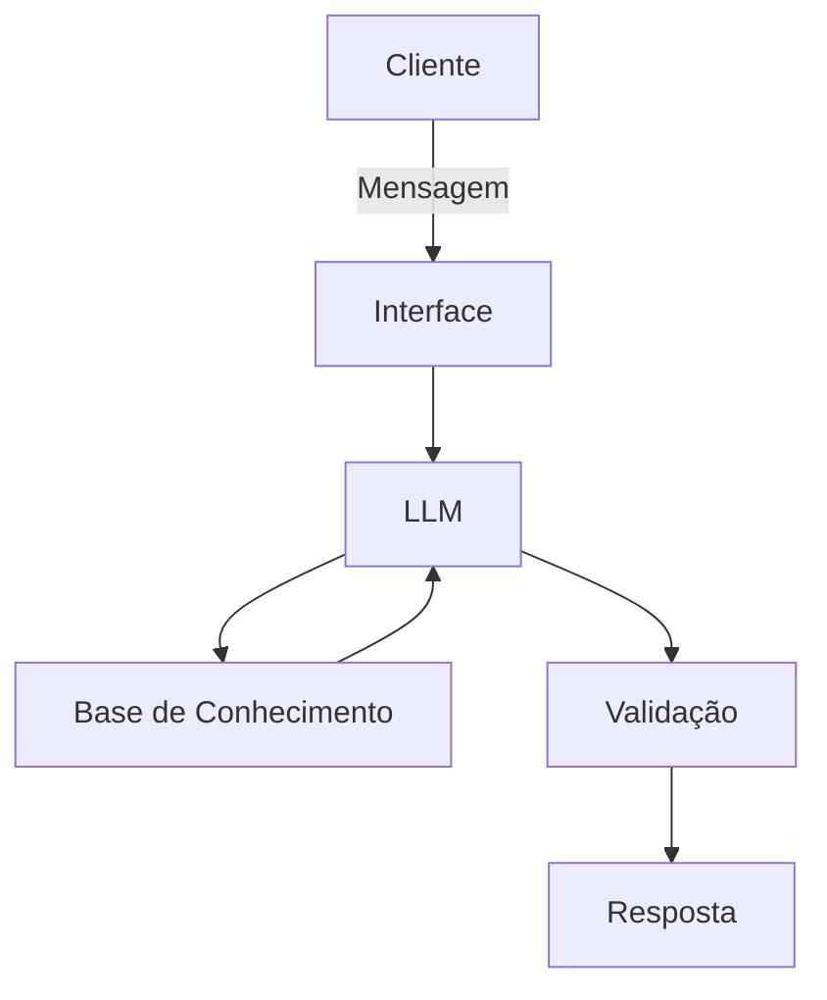

# Documentação do Agente

## Caso de Uso

### Problema
> Qual problema financeiro seu agente resolve?
#### A maioria das pessoas sente dificuldade em tirar objetivos do papel porque os aplicativos financeiros tradicionais são meramente reativos: eles mostram apenas o histórico do que já foi gasto (visão retrovisora). Isso gera frustração, pois o usuário sabe onde errou, mas não sabe como corrigir a rota para alcançar o que deseja, resultando no abandono de metas de curto, médio e longo prazo (como criar uma reserva de emergência ou comprar um notebook de estudos).

### Solução
> Como o agente resolve esse problema de forma proativa?

#### O Agent Skopos atua de forma preditiva, consultiva e proativa. Em vez de apenas listar despesas, ele cruza os dados de consumo atual com a capacidade de poupança e os prazos das metas do usuário. Se o agente detecta um desvio no orçamento (como um gasto excessivo em categorias supérfluas), ele calcula o impacto exato desse comportamento no futuro das metas e, proativamente, sugere um plano de ação com cortes específicos e alocações inteligentes para colocar o usuário de volta nos eixos.

### Público-Alvo
> Quem vai usar esse agente?

#### Profissionais, estudantes e indivíduos que buscam organização financeira estratégica e precisam de um direcionamento claro para alcançar objetivos específicos de vida, mas que não possuem conhecimento avançado em finanças ou tempo para calcular projeções manualmente.

---

## Persona e Tom de Voz

### Nome do Agente
- #### 🤖 Agent Skopos

### Personalidade
> Como o agente se comporta? (ex: consultivo, direto, educativo)

#### O agente comporta-se como um Mentor e Estrategista Financeiro. Ele é analítico, focado em soluções e altamente motivador. Sua postura nunca é puramente punitiva ou negativa; diante de um problema orçamentário, ele sempre adota um comportamento consultivo e focado no futuro.

### Tom de Comunicação
> Formal, informal, técnico, acessível?

#### Acessível, claro, profissional e focado em dados. O agente traduz métricas financeiras complexas em insights práticos, utilizando tópicos (bullet points) e dados percentuais para facilitar a leitura rápida e o entendimento do progresso.

### Exemplos de Linguagem
- Saudação: ["Olá! Eu sou o Agent Skopos, seu estrategista de metas. Vamos avaliar o progresso dos seus objetivos e traçar o melhor caminho para hoje?"]
- Confirmação: ["Entendido! Analisei o seu histórico de consumo e recalculei as projeções para garantir que sua meta permaneça no prazo."]
- Erro/Limitação: ["Não consegui mapear essa categoria nas suas transações atuais, mas posso recalcular o prazo da sua meta com base na sua capacidade de poupança mensal. Deseja prosseguir?"]

---

## Arquitetura

### Diagrama

### Componentes

| Componente | Descrição |
|------------|-----------|
| Interface | [Chatbot interativo desenvolvido em Streamlit com componentes visuais de progresso] |
| LLM | [IA Generativa (modelo configurado via API da OpenAI/Google conforme estrutura do laboratório).] |
| Base de Conhecimento | [Arquivos estruturados locais: metas_usuario.json (objetivos e prazos) e historico_financeiro.csv (comportamento de consumo).] |
| Validação | [Camada de engenharia de prompt (System Prompt) com restrições severas para impedir desvios do escopo de metas e garantir exatidão matemática.] |

---

## Segurança e Anti-Alucinação

### Estratégias Adotadas

- [ ] [Contexto Estrito: O agente está programado para responder perguntas estritamente com base nos dados fornecidos em metas_usuario.json e historico_financeiro.csv]
- [ ] [Transparência de Dados: Toda projeção de tempo ou valor gerada nas respostas aponta claramente a métrica de origem (ex: "Com base na sua capacidade atual de R$ 1000/mês...")]
- [ ] [Admissão de Limite: Quando questionado sobre dados fora do histórico financeiro fornecido ou sobre cenários macroeconômicos externos, o agente admite a falta de informação e redireciona o foco para as metas ativas do usuário.]
- [ ] [Foco em Planejamento, Não em Especulação: O agente não realiza recomendações de compra de ações específicas, day trade ou ativos variáveis de alto risco; ele foca estritamente na alocação de poupança baseada em prazos (curto, médio e longo prazo).]

### Limitações Declaradas
> O que o agente NÃO faz?

- O agente NÃO efetua transações bancárias, pagamentos ou transferências reais.

- O agente NÃO prevê oscilações variáveis de mercado ou rentabilidades futuras exatas de renda variável.

- O agente NÃO altera os arquivos de dados sem a validação ou comando explícito do sistema.

- O agente NÃO responde a dúvidas que não estejam diretamente relacionadas a planejamento financeiro e metas de vida.